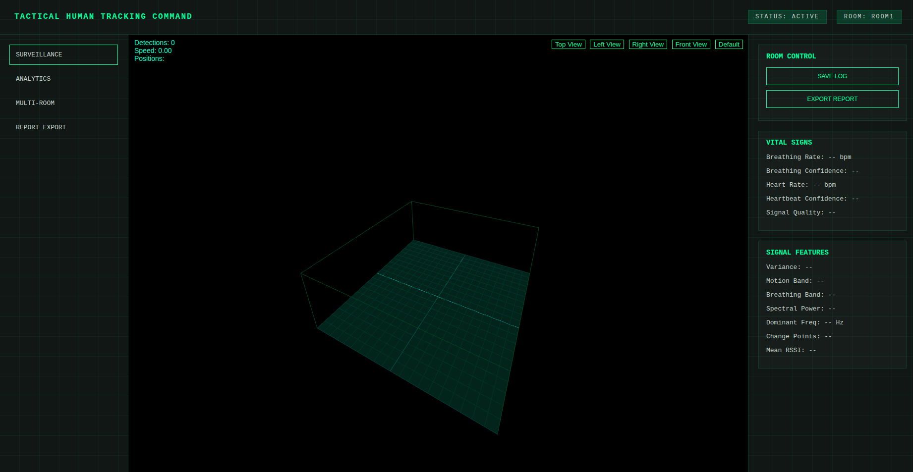

# 🚀 Tactical Human Tracking Command

A tactical system designed for human tracking, monitoring, and command operations using AI and computer vision.



---
## ⚙️ Features
- Real-time human detection
- Tracking and identification
- Command/control interface
- Web-based dashboard (Flask)
- Integration with AI models

---
## 🧠 Tech Stack
- Python
- Flask
- OpenCV
- AI/ML Models
- JavaScript (Frontend)


---
## 🚀 Installation

```bash
git clone https://github.com/your-username/tactical-human-tracking-command.git
cd tactical-human-tracking-command
pip install -r requirements.txt
python app.py
```

---
## ▶️ Usage

Run the application and open:
```
http://127.0.0.1:5000
```

---
## ⚠️ Disclaimer

This project is for educational and research purposes only.


---
## 🤝 Contributing

Contributions are welcome! Feel free to fork the repo and submit a pull request.

---


## 📝 License
This project is licensed under the **License**. See the [LICENSE.txt](LICENSE.txt) ⚖️ file for details.


---
## ❤️ Support This Project
If you find this project useful, consider supporting its development:

💰 Via PayPal: [[PayPal Link](https://www.paypal.com/ncp/payment/KC9EETJDVZQHG)]

Your support helps keep this project alive! 🚀🔥
